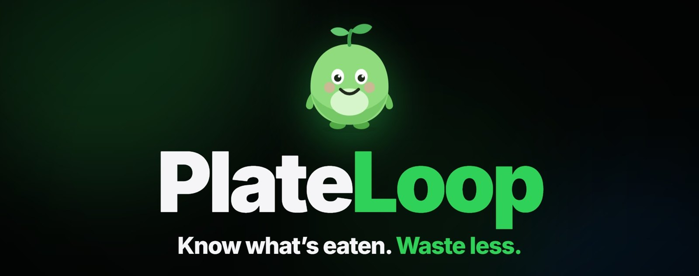
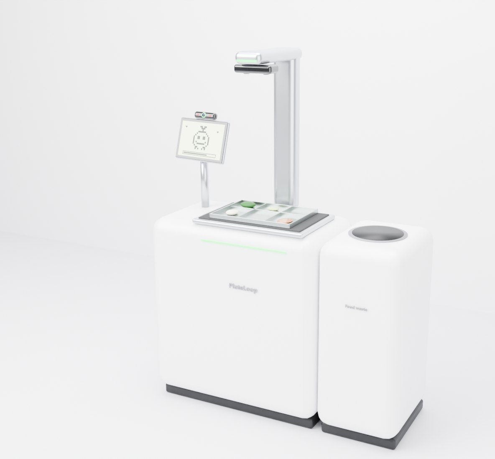
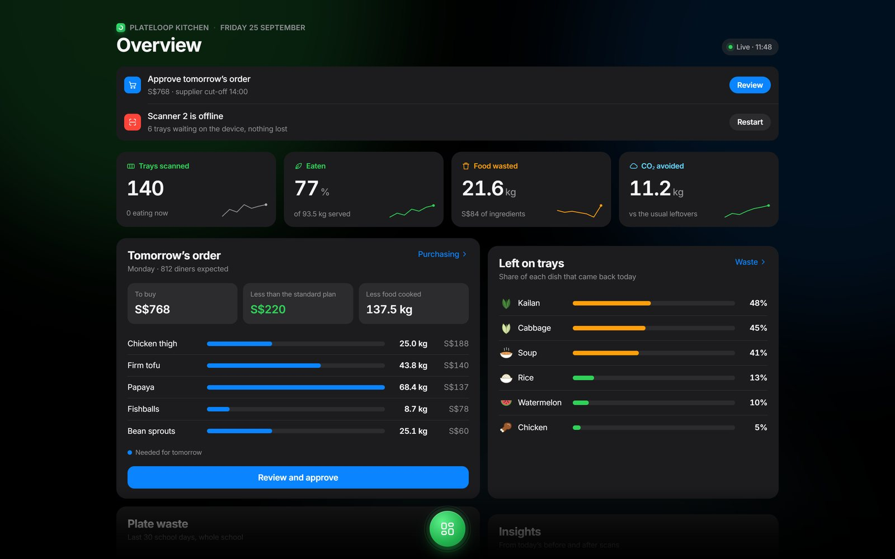
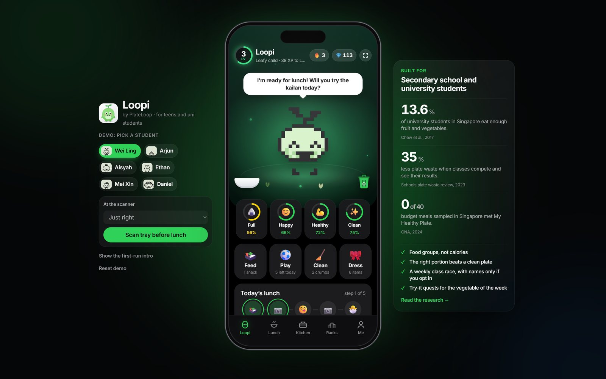
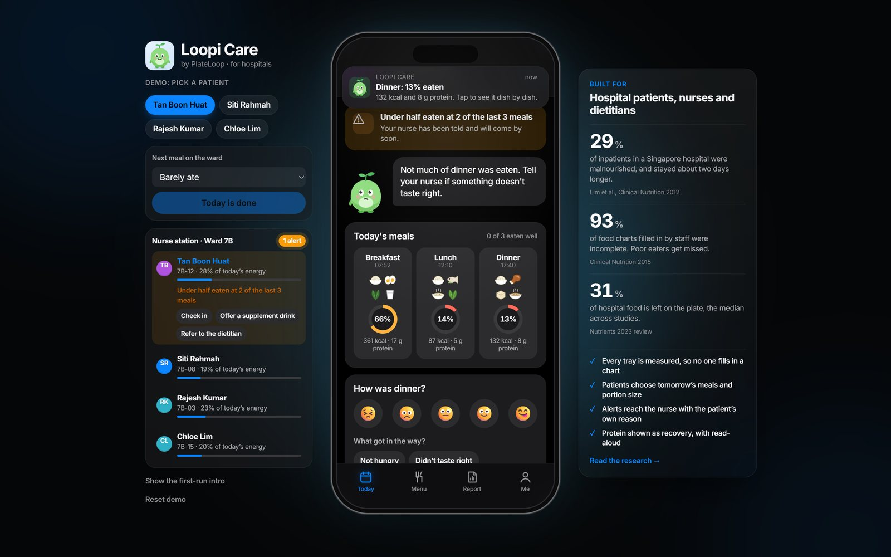
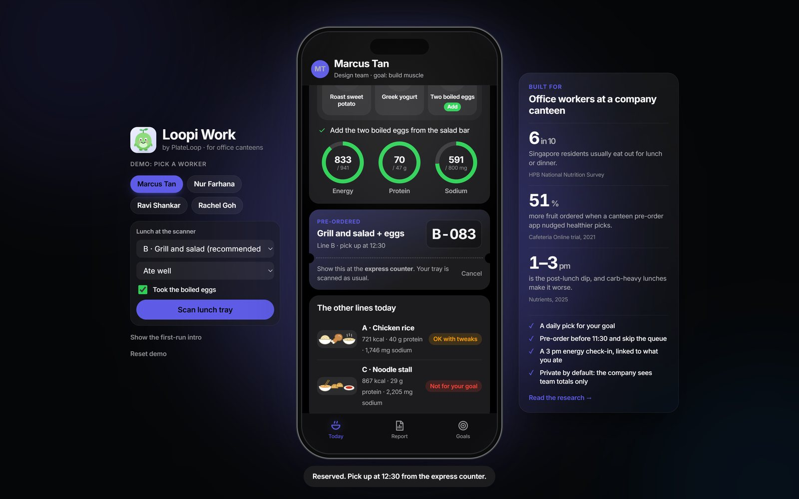

<p align="center"></p>

<p align="center">
  <a href="https://8jiwoo.github.io/plateloop/"></a>
  <a href="https://8jiwoo.github.io/plateloop/#video"></a>
  <a href="https://8jiwoo.github.io/plateloop/pitch/"></a>
  <a href="poster/plateloop-poster-A1.pdf"></a>
</p>

**PlateLoop is an AI food scanner that recognises every dish and measures what is served, eaten and left on every tray, down to the nutrients, so canteens cook the right amount, cut food waste and cost, and track their carbon. Everyone who eats gets their own feedback, in an app made for schools, hospitals or offices.**

Built for the **EcoLoop sustainability hackathon** in Singapore, with local menus, HPB nutrition guidance and the Singapore grid's emission factor.

---

## The problem

| 755,000 t | 28% | 8–10% |
|---|---|---|
| of food thrown away in Singapore in 2023; only about 18% recycled | of the world's food waste comes from food service | of global greenhouse gas emissions come from lost or wasted food |

Canteens cook by guesswork, because nobody measures what people actually eat. Bins get weighed, but a bin can't tell you which dish came back, or who didn't eat.

## How it works



1. **Sign in** by looking at the camera (a match code, never a stored photo), or type a class number.
2. **Scan before** you eat: the depth camera and scale see what you were served.
3. **Eat**, taking what you'll finish.
4. **Scan after**: what's left is weighed into the food waste bin.

**620 g served − 95 g left = 525 g eaten**, in about two seconds. Every scan measures three things:

- **Food type:** the AI recognises each dish on the tray.
- **Amount:** grams served, left and eaten, per dish and per person.
- **Nutrients:** energy, protein, carbs, fat, fibre and sodium actually eaten, plus food groups against My Healthy Plate.

It's a proven method: research systems that scan trays before and after the meal with a depth camera identify about 89% of foods, and their nutrient estimates closely match the real values (Pfisterer et al., *JMIR Aging* 2022; Lu et al., 2020).

<br clear="right">

## One scan, four apps

| | |
|---|---|
|  | **PlateLoop Kitchen** · *canteen staff*<br>Tomorrow's order from real attendance, weather and events. Waste by dish, nutrition, and a carbon ledger ready for reporting. |
|  | **Loopi** · *students*<br>The home screen is a virtual pet that only eats the lunch you really ate. Less waste keeps it healthy, earns hearts and levels it up. Food groups, not calories. Daily and weekly challenges, and a class race. |
|  | **Loopi Care** · *hospitals*<br>Every tray measured, no food charts. Patients choose tomorrow's meals and portion size, and after a poor meal they say why; the reason reaches the nurse station with the alert. |
|  | **Loopi Work** · *offices*<br>A health goal becomes a daily canteen pick. Pre-order to skip the queue, a 3 pm energy check-in shows which lunches leave you flat, and it's private by default. |

Plus **[PlateLoop Prototype](https://8jiwoo.github.io/plateloop/dist/1-plateloop-scanner-3d.html)**, an explorable 3D scanner with the working kiosk on its screen, and **[Lunch Rush](https://8jiwoo.github.io/plateloop/dist/8-plateloop-lunch-rush-3d.html)**, a first-person 3D game of one school lunch with the scanner.

| App | Open | File |
|---|---|---|
| PlateLoop Prototype + Kiosk | [live](https://8jiwoo.github.io/plateloop/dist/1-plateloop-scanner-3d.html) · [kiosk](https://8jiwoo.github.io/plateloop/dist/1-plateloop-scanner-3d.html?kiosk) | `dist/1-plateloop-scanner-3d.html` |
| PlateLoop Kitchen | [live](https://8jiwoo.github.io/plateloop/dist/3-plateloop-kitchen.html) | `dist/3-plateloop-kitchen.html` |
| Loopi | [live](https://8jiwoo.github.io/plateloop/dist/4-loopi-student-app.html) | `dist/4-loopi-student-app.html` |
| Loopi Care | [live](https://8jiwoo.github.io/plateloop/dist/5-loopi-care-hospital.html) | `dist/5-loopi-care-hospital.html` |
| Loopi Work | [live](https://8jiwoo.github.io/plateloop/dist/7-loopi-work-office.html) | `dist/7-loopi-work-office.html` |
| Lunch Rush | [live](https://8jiwoo.github.io/plateloop/dist/8-plateloop-lunch-rush-3d.html) | `dist/8-plateloop-lunch-rush-3d.html` |

Every app is one self-contained HTML file that works offline. They share one demo save, so a tray scanned on the kiosk shows up in Kitchen and Loopi open in other tabs.

## Built from research

Each app answers what its users struggle with at meals ([full research and sources](docs/research.md)):

- **Students:** only 13.6% of university students eat enough fruit and vegetables, and calorie counting can harm teens. Loopi shows food groups, and class competition cut plate waste by 35% in a Swedish school study.
- **Patients:** 29% of inpatients in a Singapore hospital were malnourished, and 93% of hand-filled food charts were incomplete. Choosing your own meals raises intake.
- **Office workers:** 6 in 10 eat out at least four times a week, and obesity rose to 12.7%. Ordering ahead leads to lighter lunches (690 office workers, VanEpps et al. 2016).

We followed design thinking (Empathise, Define, Ideate, Prototype, Test), then walked every step until it broke. Six problems became features, from "face not recognised" to "is it filming me?". The [pitch deck](https://8jiwoo.github.io/plateloop/pitch/) tells the whole story.

## Impact

**Measuring works:** when 86 catering sites in six countries, including Singapore, started measuring their food waste, they cut it by **36% in the first year** and got a **6:1 return** ([Champions 12.3, 2018](https://champions123.org/the-business-case-for-reducing-food-loss-and-waste-caterers/)).

For one school serving 800 meals a day, assuming a smaller 30% cut (to validate in a pilot): **5.7 t** less food thrown away, **14.3 t** CO₂e avoided, **S$28,500** of ingredients saved, paying back a year of the subscription in **2.4 months**. Try your own numbers on the deck's impact calculator.

## Explainer video, pitch deck and poster

| | |
|---|---|
| **[Explainer video](https://8jiwoo.github.io/plateloop/#video)** ([MP4](video/plateloop-explainer.mp4) · [WebM](video/plateloop-explainer.webm)) | about 3½ minutes, narrated, with subtitles. Source: `video/film.html`, built by `video/make.py`. |
| **[Pitch deck](https://8jiwoo.github.io/plateloop/pitch/)** | 25 slides; the prototype slides run the real apps live. ← → to move, N for notes, F for full screen. |
| **[Expansion plan](docs/plateloop-growth-report.pdf)** | a 4-page report: what PlateLoop does, the problem (NEA data), the evidence, the six expansion stages from one school canteen to hospitals, offices and individuals, sector indicators, risks and references. Built by `tools/build_report.py`. |
| **[A1 poster](poster/plateloop-poster-A1.pdf)** | print-ready PDF, plus versions split into A4 sheets: [8 sheets, borderless](poster/plateloop-poster-A1-in-8-A4.pdf) or [15 sheets for a home printer](poster/plateloop-poster-A1-home-printer.pdf). |

## Run it

Double-click any file in `dist/`. For the most reliable cross-tab demo, serve the folder:

```bash
python -m http.server 8765
```

Then open http://localhost:8765/dist/1-plateloop-scanner-3d.html?kiosk next to http://localhost:8765/dist/4-loopi-student-app.html, scan a tray on the kiosk and watch Loopi react. The development version, with every app behind one switcher, is at http://localhost:8765/apps/.

## Project layout

```
apps/        app sources (vanilla JS, one design system in css/apple.css); build.py makes dist/
dist/        the six standalone apps (generated)
pitch/       the pitch deck (one HTML file)
poster/      the A1 poster: HTML source, PDF, PNG and A4 splits
video/       the explainer: film.html, make.py, screenshots and the MP4
hardware/    the scanner in Blender: build script, .blend, .glb, renders
docs/        overview, research, screenshots
tools/       capture.py (screenshots), poster.py (poster PDF), tiles.py (A4 splits)
```

## Rebuild

```bash
pip install pillow selenium numpy imageio-ffmpeg pypdf reportlab
python apps/build.py dist     # the standalone apps
python tools/capture.py       # fresh screenshots
python tools/poster.py        # poster PDF and PNG
python tools/tiles.py         # poster split into A4 sheets
python video/make.py          # the explainer video (Windows: uses the built-in voice)
```

The 3D scanner model needs Blender 4.2+: `blender --background --python hardware/build_scanner.py -- hardware`.

## Notes

- Names, numbers, nutrition targets and CO₂ factors are demo or illustrative values; check the sources in [docs/research.md](docs/research.md) before quoting them.
- The scanner would keep a face match code on the device, never a photo; the demo simulates the match.
- The Loopi game systems are adapted from our Eggotchi prototype. Some kitchen features take inspiration from existing school-meal scanners such as Nuvilab.
