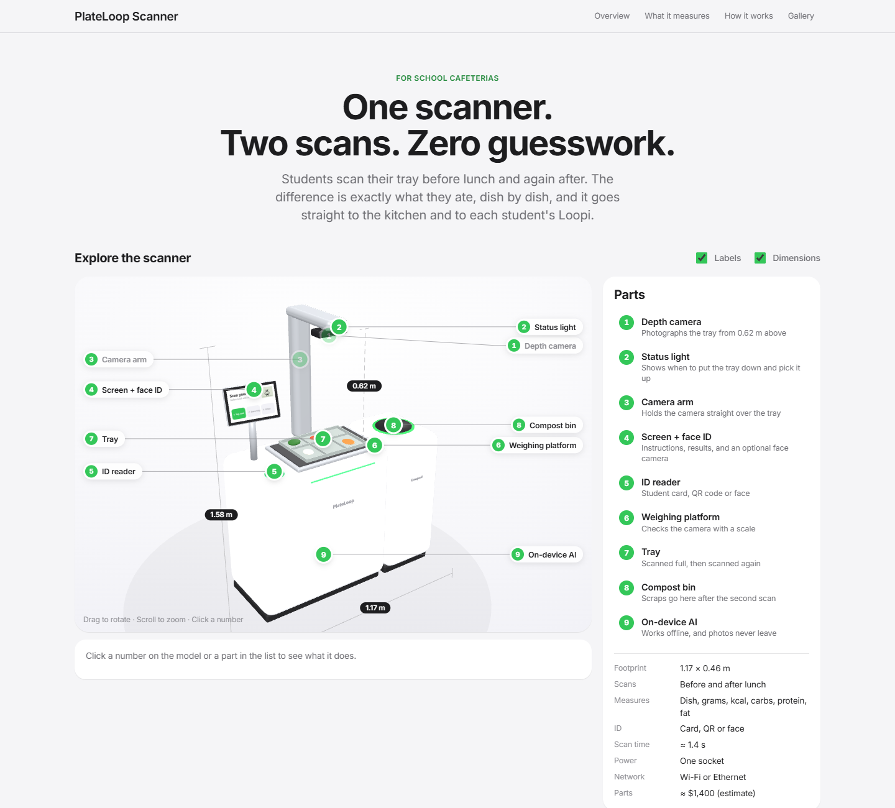

# PlateLoop

**Live demo:** https://8jiwoo.github.io/plateloop/ · **Pitch deck:** https://8jiwoo.github.io/plateloop/pitch/

**An AI food scanner that analyses what is served, eaten and left, so cafeterias order the right amount, cut food waste and cost, and track their carbon emissions. Everyone who eats gets their own nutrition report, in an app made for schools, hospitals or offices.**

Built for the EcoLoop sustainability hackathon, set in Singapore: local menus, HPB nutrition guidance (under 2,000 mg sodium a day) and the Singapore grid's emission factor.

People sign in with their face and scan their tray **before** the meal (what was served) and **after** it (what's left). The difference is exactly what each person ate, dish by dish. That data drives five apps, plus a 3D game that shows the whole experience:

| App | File | For |
|---|---|---|
| **PlateLoop Prototype** | `dist/1-plateloop-scanner-3d.html` | A full-screen, cinematic 3D scanner: drag to turn, scroll to zoom, tap a glowing light on a part to fly to it and read how it works. The display's panel opens the working **Kiosk** on the scanner's own screen (face sign-in, before and after scans, nutrition, the Green Tree). Add `?kiosk` to open straight into the kiosk. |
| **PlateLoop Kitchen** | `dist/3-plateloop-kitchen.html` | Kitchen staff and dietitian: a dark, flat live-service dashboard: servings left vs AI demand per dish with one action each (prepare more, hold, stop cooking), the lunch rush and every batch on one timeline, tap a dish for details, a full-screen Service mode for the kitchen wall, optional chime for red alerts, a demo Play lunch button, and an end-of-lunch wrap-up that feeds tomorrow's plan. Plus live scans, dishes, nutrition, environment, carbon management, plan & order, daily report |
| **Loopi** | `dist/4-loopi-student-app.html` | Teens and university students: a Tamagotchi fed by real lunches, their tray and healthy plate, class and school leaderboards |
| **Loopi Care** | `dist/5-loopi-care-hospital.html` | Hospital patients: intake against their diet, low-intake alerts, weekly healthcare report for the care team |
| **Loopi Work** | `dist/7-loopi-work-office.html` | Office workers: personal goals (build muscle, lose weight, steady energy, eat balanced), a daily canteen pick, meal feedback and a weekly healthcare report |
| **Lunch Rush** | `dist/8-plateloop-lunch-rush-3d.html` | A first-person 3D game of one school lunch with PlateLoop, with low-poly characters and a foggy, rainy atmosphere: take a tray, choose how much of each dish at the stall, face sign-in and scan at the real scanner model (the camera moves in to read its screen), eat with friends, scan again, scrape into the food waste bin, return the tray. Characters talk to you; synthesised positional sound. The scans are real and show up in the other apps |



## Pitch deck

`pitch/index.html` is the judges' deck: 24 slides that follow design thinking (Empathise → Define → Ideate → Prototype → Test), then impact, business model, competition and the ask. The prototype slides embed the real apps live, the impact slide is a savings calculator, and the last slide has a QR code to the demo.

- **← →** or click the arrows to move, **N** for speaker notes, **F** for full screen. Add `#12` to the URL to open a slide.
- Print to PDF from the browser for a static copy (one slide per page).
- Statistics on slides 2 and 7 cite NEA, UNEP, SFA and MSE; check the latest figures before presenting. Personas are built from observation; swap in quotes from your own interviews if you have them.

## Run it

**Quickest:** double-click any file in `dist/`. Each app is a single self-contained HTML file.

**Live demo across apps:** the apps share one demo save in the browser. Open the Kiosk and Loopi (or Kitchen) in two tabs of the same browser, scan a tray on the Kiosk, and watch the other tab update. For the most reliable sync, serve the folder:

```bash
python -m http.server 8765
```

Then open http://localhost:8765/dist/1-plateloop-scanner-3d.html?kiosk and http://localhost:8765/dist/4-loopi-student-app.html.

**Development version** (every app in one page with a switcher): serve the repo as above, then open http://localhost:8765/apps/.

## Project layout

```
apps/                 source for the apps
  index.html          dev page with an app switcher
  css/apple.css       design system (light + dark)
  js/core.js          menu, before/after scans, nutrition, storage sync
  js/visual.js        Loopi the guide, food drawings, tray, My Healthy Plate, gauges
  js/game.js          the Tamagotchi's rules (lunch feeds Loopi, hearts, eggs and the Barn, cooking, Healthy Catch, crates, badges)
  js/room.js          Loopi's animated pixel room
  js/health.js        hospital menus, demo people, healthcare report parts
  js/model.js         PlateLoop Prototype: the explorable 3D scanner (built in three.js), hotspots, kiosk mode
  js/scanner.js       PlateLoop Kiosk (runs on the scanner's screen inside PlateLoop Prototype)
  js/kitchen.js       PlateLoop Kitchen
  js/student.js       Loopi student app
  js/care.js          Loopi Care (hospital patients)
  js/work.js          Loopi Work (office workers: goals, targets, daily pick, weekly report)
  js/game3d.js        Lunch Rush: the lunch, dialogue, scanner close-ups, input (three.js, PS1-style rendering)
  js/lunch/           Lunch Rush parts: kit (PS1 materials, painted textures), audio (synthesised soundscape),
                      people (characters), world (the canteen), screen (the scanner's screen)
  vendor/             three.js r128 + GLTFLoader (for offline 3D)
  build.py            builds the standalone files in dist/
dist/                 the standalone apps (generated, committed for convenience)
hardware/             Blender scanner: build script, .blend, .glb, renders
docs/                 project overview (with the system design) and screenshots
pitch/                the pitch deck (one HTML file)
```

## Rebuild the standalone apps

After editing anything in `apps/`:

```bash
pip install pillow
python apps/build.py dist
```

To rebuild the 3D scanner (needs Blender 4.2+):

```bash
blender --background --python hardware/build_scanner.py -- hardware
```

## Committing in small bits

Keep each commit to one idea, such as "Add zero-leftover chip to kiosk" or "Fix kitchen sidebar height".

```bash
git status                  # see what changed
git add -p apps/js/kitchen.js   # stage only the pieces that belong to this commit
git commit -m "Add zero-leftover rate to kitchen overview"
git push
```

Useful habits:
- `git add -p` lets you pick individual chunks, so one file can go into two separate commits.
- If you change something in `apps/`, rebuild `dist/` and commit the rebuilt files in their own commit, e.g. `Rebuild dist`.
- `git log --oneline` shows the history at a glance.

## Notes

- All names, numbers, nutrition targets and CO₂ factors are demo or illustrative values. Replace them with your national school-meal standard and published factors (e.g. EPA WARM) before presenting.
- Students sign in only with their face. The scanner would keep a match code on the device, never a photo; the demo just simulates the match.
- The Loopi game systems are adapted from our Eggotchi prototype. Some features (health report, environment dashboard, green tree, face sign-in) take inspiration from existing school-meal scanners such as Nuvilab.
